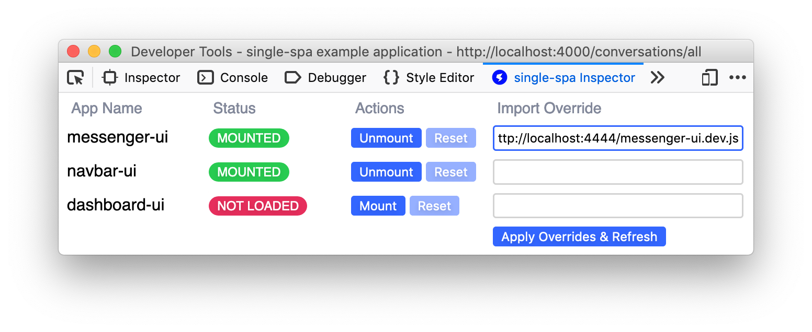

# single-spa Devtools Inspector

A Firefox/Chrome devtools extension to provide utilities for helping with [single-spa](https://single-spa.js.org) applications.

Requires >= single-spa@4.1

## Installation links

- [Firefox](https://addons.mozilla.org/en-US/firefox/addon/single-spa-inspector/)
- [Chrome](https://chrome.google.com/webstore/detail/single-spa-inspector/emldbibkihanfiaiaghebffnbahjcgcp)

Note: you can also build and run this locally. See [how to contribute](#how-to-contribute)

## Features

- List all registered applications (mounted at top)
- Show all application statuses (statii)
- Force mount and unmount an application
- Show app overlays (see [configuring app overlays](#configuring-app-overlays) to enable this feature)
- Provides an interface for adding [import-map overrides](#import-map-overrides)

## Configuring app overlays

App overlays allow you to hover over a mounted app's name and have an "inspect element" type experience which shows where the app is in the DOM. This is especially useful for when multiple apps are mounted at the same time (e.g. in some places Canopy has upwards of 4 apps mounted on a single page/URL!).

To add app overlays, find the file where you export your lifecycle functions (e.g. `bootstrap`, `mount`, `unmount`) and add another exported object with the following shape:

```js
// must be called "devtools"
export const devtools = {
  overlays: {
    // selectors is required for overlays to work
    selectors: [
      // an array of CSS selector strings, meant to be unique ways to identify the outermost container of your app
      // you can have more than one, for cases like parcels or different containers for differet views
      "#my-app",
      ".some-container .app"
    ],
    // options is optional
    options: {
      // these options allow you some control over how the overlay div looks/behaves
      // the listed values below are the defaults

      width: "100%",
      height: "100%",
      zIndex: 40,
      position: "absolute",
      top: 0,
      left: 0,
      color: "#000", // the default for this is actually based on the app's name, so it's dynamic. can be a hex or a CSS color name
      background: "#000", // the default for this is actually based on the app's name, so it's dynamic. can be a hex or a CSS color name
      textBlocks: [
        // allows you to add additional text to the overlay. for example, you can add the name of the team/squad that owns this app
        // each string in this array will be in a new div
        // 'blue squad', 'is awesome'
        // turns into:
        // <div>blue squad</div><div>is awesome</div>
      ]
    }
  }
};
```

## Import-map Overrides

If your environment uses [import-maps](https://github.com/WICG/import-maps), single-spa Inspector provides an interface for adding import-map overrides when utilizing the [import-map-overrides](https://github.com/joeldenning/import-map-overrides) library. Once the [installation requirements](https://github.com/joeldenning/import-map-overrides#installation) for import-map-overrides are completed, you can add, remove, and refresh the page with your overrides.



## Feature requests

If you would like to request a feature to be added, please open an issue with the title "Enhancement:"

---

## How to contribute

To fix a bug, add features, or just build the extension locally:

1. Install Firefox (Chrome support coming)
1. [Create a FF profile](#create-a-firefox-dev-profile) called `single-spa-inspector-dev`
1. Clone this repo
1. `nvm use` (ensures we're all using the same version of node)
1. `npm i`
1. `npm start`
1. Open devtools and navigate to the **single-spa Inspector** tab

### Create a Firefox dev profile

Currently, development happens by default in Firefox. If you would like Firefox to remember any settings that you change to Firefox itself, this project is configured to use a profile called "single-spa-inspector-dev". To create this profile, go to [about:profiles](about:profiles). Firefox will use that profile and remember any changes you make (e.g. devtools location, devtools dark mode, etc.)

### Debugging

Once single-spa Inspector is running, open a new tab and navigate to [about:debugging](about:debugging). single-spa Inspector should be listed as a Temporary Extension, and a "Debug" control should be displayed. Click on this to enable devtools for the extension. In the upper-right corner, click on the divided square icon next to the 3-dot menu, and select `/build/panel.html` as the target. You can now inspect the inspector UI as you would a normal webpage.

### Publishing a New Version

1. Update the version in `manifest.json` and `package.json` (they should match)
1. Ensure that the necessary Firefox env values are in your local .env

   ```
   WEXT_SHIPIT_FIREFOX_JWT_ISSUER=xxxxx
   WEXT_SHIPIT_FIREFOX_JWT_SECRET=xxxxx
   ```

1. Ensure that the necessary Chrome env values are in your local .env

   ```sh
   WEXT_SHIPIT_CHROME_EXTENSION_ID=xxxxx
   WEXT_SHIPIT_CHROME_CLIENT_ID=xxxxx
   WEXT_SHIPIT_CHROME_CLIENT_SECRET=xxxxx
   WEXT_SHIPIT_CHROME_REFRESH_TOKEN=xxxxx
   ```

1. Run `npx patch-package` due to an import bug in @wext/shipit that we have patched locally

- this would need to be run after every `npm install`

1. Run `npm run deploy`

- Alternatively, to deploy individual browsers you can run `npm run deploy:firefox` or `npm run deploy:chrome`

You may also want to verify the status at the respective extensions page

- [Firefox Add-on Developer Hub](https://addons.mozilla.org/en-US/developers/)
- [Chrome Store Developer Dashboard](https://chrome.google.com/webstore/developer/dashboard)

---

## Thanks

- Built with [web-ext](https://github.com/mozilla/web-ext) which makes for a better dev experience
- Uses [webextension-polyfill](https://github.com/mozilla/webextension-polyfill) to make cross-platform dev easier
- [React Devtools](https://github.com/facebook/react-devtools) for showing how to do some of these things
- And [CanopyTax](https://www.canopytax.com) for indirectly funding this :)
